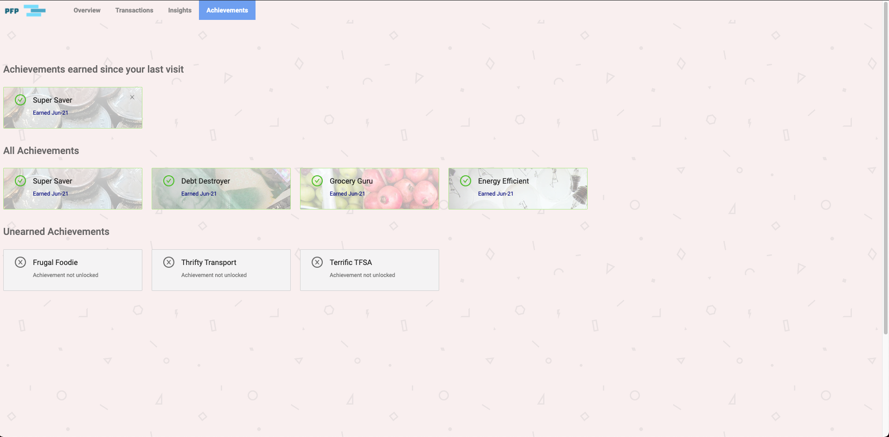

# Personal Financial Planner

Are you looking for a app to keep a track of your spending and also receive meaningful insights about it?

Personal Financial Planner is the perfect solution!

It is a single page application (SPA) built with React that allow the users to connect their bank account, take a look at their transactions and receive meaningful insights about your spending.

## Final Application

### Overview

### Transactions

### Insights

### Achievements

## Application Stack

Front-End: React.js , HTML, CSS
Back-End: Node.js, Express
Database: PostgreSQL

## Setup
1. Install dependencies with `nm install`.
2. In the terminal, go into the "back-end" directory and start the server with `node index.js`.
3. In the terminal, go into the "personal-financial-planner" directory and start the development server with `npm start`.
4. The application will automatically load on your browser at <http://localhost:3000//>.

